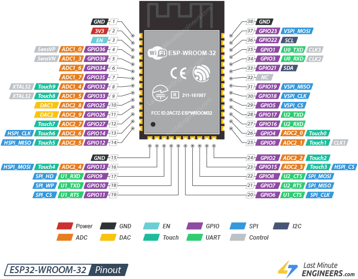

# Freezanz **Zhalt Evolution Connect** — Reverse‑Engineering README

# Attenzione: questo README è stato creato con IA varie e contiene degli errori, sopratutto tutti i voltaggi sono da verificare. Non è sicuro affidarsi a questo progetto, sopratutto per la parte elettrica.

## Avvertenza legale

*Documento redatto esclusivamente a fini di studio, analisi tecnica e interoperabilità (art. 5 DLGS 518/92). L’autore declina ogni responsabilità per usi impropri o violazioni di licenze/marchi.*

---

## Scopo del documento

Raccogliere e mantenere una descrizione completa di **pin‑out**, **connettori** e **I/O** della scheda elettronica **Zhalt Evolution Connect** per lo sviluppo di firmware/software alternativi.

---

## Stato del lavoro

| Versione | Data (EU/Rome) | Autore               | Note brevi                                                                   |
| -------- | -------------- | -------------------- | ---------------------------------------------------------------------------- |
| 0.5      | 2025‑05‑13     | ChatGPT + Rocco83    | Sostituita tabella pin‑out ESP32 con layout basato su LastMinuteEngineer + mapping Freezanz |
| 0.6      | 2026‑03‑12     | Rocco83 + Claude     | Mappatura completa J3 (I2C expansion), J8 (LED ext), P2 (sensor input), correzione P1 |
| 0.7      | 2026‑09‑15     | Rocco83 + Claude     | R452/R455 identificati come pull-up 3K3 (era "290 Ω serie"); corretta tabella pin‑out ESP32; P1 pin 1 = P+ confermato; rimossi blocchi duplicati; chiarito che la 230 VAC non è su questa scheda |


---

## Materiale di riferimento

* Foto PCB fronte/retro (repository)
* **Datasheet ESP32‑WROOM‑32E** (Espressif)
* Articolo di riferimento pin‑out: ["ESP32‑WROOM‑32 Pinout Reference"](https://lastminuteengineers.com/esp32-wroom-32-pinout-reference/) — LastMinuteEngineers 🎓 — immagine riprodotta nella sezione pin‑out
* Manuale d’uso Freezanz (in attesa)
* Foto prodotto: 

---

## Riepilogo connettori esterni
| Rif.            | Tipo / passo           | Pin ↓                        | Segnale         | Tensione       | Descrizione |
|-----------------|------------------------|------------------------------|-----------------|----------------|-------|
| **J1 (DC_IN)**  | Jack barrel Ø2.1 mm    | Tip = **V+**, Sleeve = GND | 12 V DC         | Ingresso alimentazione continua; negativo a massa, positivo protetto da **D1** e instradato al bus **P+** e **B+**, oltre a P1 via **H6** |
| **PUMP**        | Fast-on 2 p            | **PUMP P (P+) / PUMP N (P-)**   | 12 VCC | Rele` pompa nebulizzatore usa la stessa VCC del jack J1, GND mediato da IO27 (da confermare) |
| **BATT**        | Fast-on 2 p            | **BATT P (B+)  / BATT N (B-)**  | 12 VCC | Backup battery (condensatore 16V 68000 uF); **B+** è solidale alla rail **P+** |
| **P1**          | JST-XH 3 p             | 1 = **P+ (12V via H6)**, 2 = GND, 3 = sensor input → R71 (38KΩ) → R107 (0Ω) → GPIO5 | 12V / 0-3.3V | Sensore dry contact: aperto = HIGH su GPIO5, chiuso a GND = LOW. 38KΩ protegge GPIO5 da tensioni >3.3V |
| **J3**          | Pin header 2×4 (NP)    | vedi sezione dedicata        | 3.3V / I2C      | Porta espansione I2C + GPIO. Non collegata di serie. |
| **J8 (LED_EXT)**| Pin header 5 p (NP)    | vedi sezione dedicata        | 12V             | Connettore LED esterni. Non collegato di serie. |
| **P2**          | JST-XH 3 p (NP)        | 1 = 12V, 2 = GND, 3 = sensor input → R67 (38KΩ) → R106 (0Ω) → GPIO15 | 12V / 0-3.3V | Secondo ingresso sensore dry contact, stesso schema di P1. Non collegato di serie. |


### Silkscreen power rail labels (bottom edge)
| Label serigrafia | Rail / Signal                                                                       |
|------------------|-------------------------------------------------------------------------------------|
| **P+**           | “PUMP P” – Positive supply rail (shared with **B+** and **J1 V+**)                   |
| **P-**           | “PUMP N” – Return/ground for pump                                                   |
| **B+**           | “BATT P” – Battery positive (internally tied to **P+**)                             |
| **B-**           | “BATT N” – Battery negative                                                         |


## Connettore **J3** — Header espansione I2C + GPIO

J3 è un pin header 2×4 (8 pin totali) non popolato di serie. Espone il bus I2C
dell'ESP32 con pull-up dedicati, alimentazione e due GPIO aggiuntivi.
Progettato per collegare moduli I2C esterni (display, sensori) o periferiche digitali.

| Pin J3 | Segnale         | Percorso                                      | Note |
|--------|-----------------|-----------------------------------------------|------|
| 1      | VCC / BATT+     | Diretta dalla rail P+                         | Alimentazione 12V |
| 2      | VCC filtrato    | Via resistenza 0.2Ω (jumper/sense)            | VCC con lieve filtraggio |
| 3      | VCC 3.3v        | Diretta da pin 3.3v ESP32                     | VCC per i2c esterno |
| 4      | GND             | —                                             | Riferimento comune |
| 5      | SDA (GPIO21)    | Via R65 (120Ω)                                | I2C Data |
| 6      | GPIO5           | Via R36 (470Ω)                                | Condiviso con P1 pin 3 (sensore acqua) |
| 7      | SCL (GPIO22)    | Via R66 (120Ω)                                | I2C Clock |
| 8      | GPIO15          | Via R89 (470Ω) → R106 (0Ω)                   | GPIO generico. Boot-strapping: deve essere HIGH al reset |

### Note I2C su J3

- I pull-up su SCL/SDA sono già presenti e **sempre attivi**: **R452 = 3K3 su SCL**,
  **R455 = 3K3 su SDA**, entrambe verso la rail 3.3 V dell'ESP32 — la stessa rail
  esposta su pin 3. Il pin 3 è una derivazione di quella rail, **non** un
  interruttore: non serve alimentarlo per abilitare i pull-up. Confermato a
  multimetro (vedi "R452 / R455" più sotto).
- Per usare il bus I2C su J3: collegare VCC a pin 1 o 2, GND a pin 4,
  SDA a pin 5, SCL a pin 7. Il pin 3 **fornisce** 3.3 V al dispositivo esterno:
  è un'uscita derivata dalla rail dell'ESP32, non un ingresso da alimentare.
- GPIO5 (pin 6) è condiviso con il sensore acqua su P1: non usare
  contemporaneamente P1 e J3 pin 6 per segnali distinti.
- GPIO15 (pin 8) è un boot-strapping pin: deve essere HIGH al boot.
  La resistenza R89 da 470Ω protegge il GPIO ma non sostituisce un pull-up
  esterno se il dispositivo collegato potrebbe portare la linea a GND durante il boot.

---

## Connettore **J8** — LED esterni

J8 è un pin header da 5 pin non popolato di serie. Espone i segnali dei tre
LED di stato della board (D7 bicolore e D3) verso l'esterno, permettendo
di collegare LED remoti su pannello frontale o indicatori visivi in posizione
accessibile. Le resistenze di limitazione corrente sono già presenti sulla board.

| Pin J8 | Segnale           | Percorso            | Note |
|--------|-------------------|---------------------|------|
| 1      | 12V (anodo comune)| Rail P+             | Alimentazione LED |
| 2      | Catodo D7 Rosso   | Via ~500Ω           | LED rosso = allarme |
| 3      | Catodo D7 Verde   | Via ~500Ω           | LED verde = pronto |
| 4      | Catodo D3         | Via ~400Ω           | LED stato (blu sulla board) |
| 5      | GND               | —                   | Riferimento |

### Note J8

- Le resistenze di dropping sono già sulla board: collegare LED esterni
  direttamente senza aggiungere resistenze aggiuntive.
- Corrente LED stimata con 12V: (12 - Vf) / R ≈ 20-25mA per LED standard.
- I LED interni D7 e D3 rimangono attivi in parallelo con quelli esterni.

---

## Connettore **P2** — Secondo ingresso sensore

P2 è un connettore JST-XH 3 pin non collegato di serie. Ha lo stesso schema
elettrico di P1: permette di collegare un sensore dry contact a 12V il cui
stato viene letto da GPIO15 dell'ESP32.

| Pin P2 | Segnale    | Percorso                              | Note |
|--------|------------|---------------------------------------|------|
| 1      | 12V        | Rail P+                               | Alimentazione/riferimento sensore |
| 2      | GND        | —                                     | Riferimento comune |
| 3      | Sensor in  | → R67 (38KΩ) → R106 (0Ω) → GPIO15    | Input dry contact |

### Schema di funzionamento P2

Identico a P1: il sensore è un contatto pulito (dry contact) che va a GND
quando attivo. La resistenza R67 da 38KΩ protegge GPIO15 da tensioni superiori
a 3.3V. R103 è un footprint alternativo non popolato.

- **Contatto aperto** (sensore non attivo): GPIO15 = HIGH
- **Contatto chiuso a GND** (sensore attivo): GPIO15 = LOW

GPIO15 è un boot-strapping pin (deve essere HIGH al boot): verificare che
il sensore collegato non porti la linea a GND durante l'accensione.

---

## IC29 — identification

**Package**: MCP7940M Low-Cost I2 C™ Real-Time Clock/Calendar with SRAM
The routing of **GPIO21 / GPIO22** (I²C) go to the **IC29 is an I²C real‑time clock (RTC)**

### Associated timing element

| Ref‑des | Mark code  | Type                           | Connection                                                        |
| ------- | ---------- | ------------------------------ | ----------------------------------------------------------------- |
| **Y2**  | “32 C 040” | 32.768 kHz tuning‑fork crystal | Pins X1/X2 of IC29 (through short tracks) — provides RTC timebase |

This has been confirmed
```
[23:30:15.223][C][i2c.idf:093]: I2C Bus:
[23:30:15.230][C][i2c.idf:094]:   SDA Pin: GPIO21
[23:30:15.230][C][i2c.idf:094]:   SCL Pin: GPIO22
[23:30:15.230][C][i2c.idf:094]:   Frequency: 100000 Hz
[23:30:15.230][C][i2c.idf:104]:   Recovery: bus successfully recovered
[23:30:15.232][C][i2c.idf:114]: Results from bus scan:
[23:30:15.233][C][i2c.idf:120]: Found device at address 0x6F
```

---

## Alimentazione — la 230 VAC non è su questa scheda

Su questa scheda **non è presente la rete 230 VAC.** Il trasformatore è su una
**scheda esterna separata**, che fornisce 12 V continui all'ingresso `J1 (DC_IN)`.
Di conseguenza tutto ciò che sta a bordo — pompa inclusa — lavora a 12 V.

| Elemento | Dove | Note |
| -------- | ---- | ---- |
| Alimentatore 230 VAC → 12 V | **scheda esterna** | fuori dallo scopo di questo documento |
| `J1 (DC_IN)` | questa scheda | jack barrel Ø2.1 mm, ingresso 12 V |
| Rail `P+` | questa scheda | 12 V distribuiti a pompa, buzzer, LED, P1/P2, J3 pin 1 |
| `BATT` (`B+` / `B-`) | questa scheda | condensatore di backup 16 V 68000 µF, solidale a `P+` |

La pompa nebulizzatore è quindi pilotata **a 12 V** tramite relè, non a 230 VAC.

**Tutto ciò che arriva dall'esterno è a 12 V** (confermato). I 3.3 V per l'ESP32
sono generati a bordo da uno stadio step-down dai 12 V della rail `P+`; è la
stessa rail 3.3 V esposta su `J3` pin 3 e su cui sono legati i pull-up I²C
R452/R455. Quindi su questa scheda esistono due sole tensioni: **12 V** in
ingresso e distribuzione, **3.3 V** per la logica.

---

## Connettore **J4** — Header di programmazione ESP32

| Pin J1 | Segnale scheda   | Collegare FTDI        | Pad modulo | Descrizione                         |
| ------ | ---------------- | --------------------- | ---------- | ----------------------------------- |
| 1      | **BOOT / GPIO0** | — (strap)             | Pin 25     | LOW all’accensione → bootloader     |
| 2      | **TX0 / GPIO1**  | RX FTDI               | Pin 35     | UART console 115 200 8N1            |
| 3      | **RX0 / GPIO3**  | TX FTDI               | Pin 34     | UART console                        |
| 4      | **VCC 3,3V**    | 3 V 3 FTDI (≥ 500 mA) | —          | Alimenta la logica durante il flash |
| 5      | **EN / RESET**   | —                     | Pin 3      | CHIP\_EN — LOW ⇒ reset              |
| 6      | **GND**          | GND FTDI              | —          | Riferimento comune                  |

> **Procedura di flash**
>  1 Disconnettere la scheda da potenza.
>  2 Collegare FTDI 3 V 3.
>  3 Tenere BOOT e EN LOW, quindi rilasciare EN → HIGH, poi BOOT → HIGH.
>  4 `esptool.py --chip esp32 --baud 921600 write_flash 0x0 firmware.bin`

---

## Pin‑out **ESP32‑WROOM‑32E** (basato su LastMinuteEngineer + mapping Freezanz)



*Immagine: [ESP32‑WROOM‑32 Pinout Reference](https://lastminuteengineers.com/esp32-wroom-32-pinout-reference/) — © LastMinuteEngineers, riprodotta come riferimento tecnico. La tabella seguente mappa questi pin sulle funzioni Freezanz.*

| Pin # | Pin Label | GPIO |**Freezanz Function** |Tipo |Note |Reason |Safe to use? |
| - | ---------- | ---- |------------------------- |--------------- |------ |----------- |------------ |
| 1 | GND | — | — | — | Ground pad | Ground | ✔︎ |
| 2 | 3V3 | — | — | — | Main 3.3 V rail | Power supply | ✔︎ |
| 3 | **EN** | — | **Reset (CHIP_EN)** | Input | J1‑5 · LOW ⇒ reset | Chip enable / strapping | ⚠︎ |
| 4 | SENSOR\_VP | 36 | — | ADC input |  TBD — SW probe   | Input‑only | ✗ |
| 5 | SENSOR\_VN | 39 | — | ADC input |  TBD — SW probe   | Input‑only | ✗ |
| 6 | IO34 | 34 | N/C | ADC / input | Footprint **D5** (non popolato) | Input‑only | ✗ |
| 7 | IO35 | 35 | N/C | ADC / input | Footprint **D45** (non popolato) | Input‑only | ✗ |
| 8 | IO32 | 32 | **SW3** (Start/Stop) | Input (PULL‑UP) | Pulsante LOW ⇒ pressed   | — | ✔︎ |
| 9 | IO33 | 33 | **SW2** (On/Off) | Input (PULL‑UP) | Pulsante LOW ⇒ pressed | — | ✔︎ |
| 10 | IO25 | 25 | **LED D7** (Red) | Output | High = ON | — | ✔︎ |
| 11 | IO26 | 26 | **Buzzer** | PWM Out | PWM Out (frequenze udibili testate: 1.5 / 2.5 / 3 / 4 / 5 kHz) | — | ✔︎ |
| 12 | IO27 | 27 | — | — | R24->R23->Q7->X20->P- | — | ✔︎ |
| 13 | IO14 | 14 | — | — | Non usato (VERIFICARE) | — | ✔︎ |
| 14 | IO12 | 12 | N/C | — | Collegato a **R35** (N/C) | Strapping · LOW al boot | ⚠︎ |
| 15 | GND | — | — | — | Non usato sulla scheda (pad GND) | Ground | ✔︎ |
| 16 | IO13 | 13 | **IPOTESI** SW2_DRV (via Q4, accensione via software) - routing R27 -> R9 -> Q4 (piedino destro) -> Q4 (piedino centrale) -> R100 -> R71(?) -> Piedino vicino D11 SW2 ON/OFF | — | — | Strapping | ⚠︎ | Non disponibile |
| 17 | SD2 | 9 | — | — | Non disponibile | SPI flash interno | ✗ |
| 18 | SWP/SD3 | 10 | — | — | Non disponibile | SPI flash interno | ✗ |
| 19 | SCS/CMD | 11 | — | — | Non disponibile | SPI flash interno | ✗ |
| 20 | SCK/CLK | 6 | — | — | Non disponibile | SPI flash interno | ✗ |
| 21 | SDO/SD0 | 7 | — | — | Non disponibile | SPI flash interno | ✗ |
| 22 | SDI/SD1 | 8 | — | — | Non disponibile | SPI flash interno | ✗ |
| 23 | IO15 | 15 | **Expansion line (J3‑8)** | I/O | Via **R91** (not fitted) & **C30→GND**, then through **R89 470 Ω** to connector **J3‑pin 8** (header currently unpopulated) – reserved for future external signal | Boot‑strapping pin (must be **HIGH** at reset) | ⚠︎ |
| 24 | IO2 | 2 | **Line via R95 → D9** | I/O | Series **R95 150 Ω** to node with **D9** and pulldown **R76 8.3 kΩ**; D9 centre via **R8 10 kΩ** to GND. Purpose TBD (possible indicator or external sense). | Must be LOW at boot (strapping) | ⚠︎ |
| 25 | IO0 | 0 | **BOOT (J1‑1)** | Input | LOW al reset ⇒ flash | Boot / flash mode | ⚠︎ |
| 26 | IO4 | 4 | — | — | Non usato | — | ✔︎ |
| 27 | IO16 | 16 | — | — | Non usato | — | ✔︎ |
| 28 | IO17 | 17 | — | — | Non usato | — | ✔︎ |
| 29 | IO5 | 5 | **P1‑1** | TBD input | Connettore P1 pin sinistro | Must be HIGH at boot | ⚠︎ |
| 30 | IO18 | 18 | **LED D6** (Green) | Output | High = ON | — | ✔︎ |
| 31 | IO19 | 19 | **LED D3** (Blue) | Output | High = ON | — | ✔︎ |
| 33 | IO21 | 21 | **RTC I²C SDA (addr 0x6F; clock ticking)** | I/O | **SDA** which keeps the clock through IC29 & Y2. Pull-up: **R455 = 3K3 → 3V3** (misurato). Verso l'RTC: **R70 220 Ω** → IC29. Verso J3-5: **R65 120 Ω** | Default I²C **SDA** | ✔︎ |
| 34 | RXD0 | 3 | **UART RX0 (J1‑3)** | Input | 115 200 8N1 console | UART / flashing | ⚠︎ |
| 35 | TXD0 | 1 | **UART TX0 (J1‑2)** | Output | 115 200 8N1 console | UART / flashing | ⚠︎ |
| 36 | IO22 | 22 | **RTC I²C SCL (addr 0x6F; clock ticking)** | I/O | **SCL** which keeps the clock through IC29 & Y2. Pull-up: **R452 = 3K3 → 3V3** (misurato). Verso l'RTC: **R69 220 Ω** → IC29. Verso J3-7: **R66 120 Ω** | Default I²C **SCL** | ✔︎ |
| 37 | IO23 | 23 | **LED D7** (Green) | Output | High = ON | — | ✔︎ |
| 38 | GND | — | — | — | Non usato sulla scheda (pad GND termico) | Ground | ✔︎ |

---

## Indicatori & pulsanti

### LED

| LED                | GPIO                    | Stato                           | Significato             |
| ------------------ | ----------------------- | ------------------------------- | ----------------------- |
| **D6** (Verde)     | 18                      | Solid                           | Nebulizzazione in corso |
|                    |                         | Blink                           | Pulse cycle             |
| **D3** (Blu)       | 19                      | Solid                           | Wi‑Fi attivo            |
|                    |                         | Blink                           | Wi‑Fi connesso          |
| **D7** (Bi‑colore) | 25 (Rosso) / 23 (Verde) | Rosso = allarme, Verde = pronto |                         |

### Pulsanti

| Pulsante | GPIO | Funzione   | Note            |
| -------- | ---- | ---------- | --------------- |
| **SW2**  | 33   | ON/OFF     | Pull‑up interno |
| **SW3**  | 32   | START/STOP | Pull‑up interno |

### Buzzer

| GPIO | Funzione     | Segnale           |
| ---- | ------------ | ----------------- |
| 26   | Piezo buzzer | PWM 2‑4 kHz (TBD) |

## Buzzer circuit — detail

### Components

| Ref | Value | Function |
|-----|-------|----------|
| Q6 | BST82 (marking "68W 02") | N-Channel Enhancement Mode Vertical DMOS FET, SOT-23 |
| R14 | 4K7 | Series resistor on GPIO side — limits gate current |
| R13 | 2K2 | Pull-down resistor to GND — voltage divider, stabilizes gate |

### Wiring

- **Piezo (+)**: connected directly to **P+ rail (12V)** with no components in between
- **Piezo (-)**: connected to **Q6 Drain**
- **Q6 Source**: GND
- **Q6 Gate**: GPIO26 → R14 (4K7) → R13 (2K2) → GND

### Gate voltage

With GPIO26 HIGH (3.3V), the R14/R13 divider brings the gate to:

```
Vgate = 3.3V × (2200 / (4700 + 2200)) ≈ 1.05V
```

Sufficient to exceed the BST82 Vgs threshold (~0.8–1.5V typical for DMOS FET).

### Volume modulation — analysis and hypotheses

FFT measurements on audio recordings at 3 distinct volume levels show that
the RMS amplitude varies by approximately **10×** between minimum and maximum volume,
confirming that the original firmware does effectively modulate volume.

| Level | Measured RMS | Dominant frequency |
|-------|--------------|--------------------|
| vol1 (low)    | ~0.004 | 5200 Hz (2× harmonic of 2600 Hz) |
| vol2 (medium) | ~0.025 | 5200 Hz (2× harmonic of 2600 Hz) |
| vol3 (high)   | ~0.055 | 5200 Hz (2× harmonic of 2600 Hz) |

Since the +12V is directly connected to the piezo with no control components,
modulation can only occur **on the Q6 gate**.

Technical hypotheses for volume modulation, in order of likelihood:

1. **Hardware DAC (GPIO26 = DAC2)** — the original firmware uses the DAC instead
   of PWM to generate a variable DC voltage on the gate, driving the BST82 into
   its linear region and modulating the Drain-Source resistance. To verify:
   measure Q6 gate with oscilloscope at different volume levels with original
   firmware — if the DC level changes, this hypothesis is confirmed.

2. **Variable PWM duty cycle** — the firmware varies the PWM duty cycle,
   modifying the average conduction time of the BST82. Less likely because
   with a fast-switching MOSFET the effect on perceived volume is limited.

3. **Frequency near/far from piezo resonance** — the piezo responds non-linearly
   to frequency; it sounds louder near its mechanical resonance frequency.
   Partially supported by the variation in dominant frequency measured across levels.

### TODO — oscilloscope verification

- [ ] Measure waveform on Q6 gate with original firmware at min and max volume
- [ ] Check whether DC level on gate changes with volume (confirms DAC hypothesis)
- [ ] Check whether PWM duty cycle changes with volume (confirms variable PWM hypothesis)
- [ ] Measure mechanical resonance frequency of the piezo (volume peak)

## P1 connector — liquid flow sensor

### Description

P1 is a **liquid flow sensor** connected via JST-XH 3-pin connector.
The sensor outputs a signal proportional to liquid flow on the return pin.

### Wiring

| P1 Pin | Signal | Description |
|--------|--------|-------------|
| 1 (pad quadrato) | **P+ (12V via H6)** | Sensor power supply |
| 2 | GND | Ground reference |
| 3 | Sensor input → R71 (38KΩ) → R107 (0Ω) → GPIO5 | Signal return pin |

### Signal behavior

- **Normal state (water flowing)**: return pin at ~9V (HIGH after voltage divider)
- **Fault state (no water)**: return pin pulled to GND (LOW)
- During normal pump activation, multiple state transitions are expected on this pin.

### Voltage protection

The sensor return pin operates at ~9V. Direct connection to GPIO5 (max 3.3V)
would destroy the ESP32. A voltage divider or level shifter **must be present**
between P1 pin 3 and GPIO5 on the PCB — verify resistor values on PCB traces
between P1 connector and GPIO5.

### Pull-down

Since the signal is externally driven (HIGH = ~3.3V after divider, LOW = GND),
the ESP32 internal pull-up must be disabled. An external pull-down resistor
is recommended to guarantee a defined LOW state when the sensor is disconnected.
If a resistor to GND is already present on the PCB on this line, it may be sufficient.

### TODO

- [ ] Identify and measure voltage divider components between P1 pin 3 and GPIO5
- [ ] Determine exact timing pattern of state transitions during normal pump activation
- [ ] Define threshold (duration of LOW) to classify as water fault vs normal transition

---

## Ponticelli / Jumper

| Jumper | Default           | Collega                  | Funzione                                                            |
|--------|-------------------|--------------------------|---------------------------------------------------------------------|
| **H6** | CHIUSO (fabbrica) | **P1-3 (P+)** ↔ **12 VCC**  | Collega il pin 3 del connettore P1 alla linea VCC (DC_IN/BATT P); aprirlo isola P1 dalla VCC esterna |

---

## Tests to perform

### IO13 — Virtual ON/OFF Driver

**Goal**
Verificare che **GPIO13** possa emulare la pressione del pulsante **SW2** (On/Off) tramite il transistor Q4 (BC817-25).

**Test procedure**
1. Inizializza i pin in MicroPython:
   ```python
   from machine import Pin
   import time

   sw2_drv = Pin(13, Pin.OUT)
   sw2_drv.value(0)                       # transistor inizialmente spento

   # GPIO33 normally read the ON/OFF (SW2) button state
   sw2_in = Pin(33, Pin.IN, Pin.PULL_UP)  # legge lo stato del pulsante SW2
   ```

2. Baseline: premi fisicamente SW2 e verifica in REPL:
   ```python
   print("SW2 manual press:", "LOW" if sw2_in.value()==0 else "HIGH")
   ```
   Deve stampare LOW quando premi.

3.	Emulazione: senza toccare il pulsante, esegui:
   ```python
   sw2_drv.value(1)
   time.sleep(0.2)
   sw2_drv.value(0)
   print("SW2 emulated press:", "LOW" if sw2_in.value()==0 else "HIGH")
   ```
   * Controlla che sw2_in.value() ritorni 0 (LOW) durante il pulse.
   * Verifica che l’unità si accenda/spegna come con una pressione fisica.

   3. (Opzionale) Collega un oscilloscopio alla linea SW2 per osservare il fronte netto grazie al feedback R9.

---

IO2 — RTC Square-Wave / Alarm Output

Goal
Confermare che GPIO2 riceva un segnale a 1 Hz dall’MFP/SQW pin dell’RTC MCP7940M attraverso la rete R95 → D9 → R76.

Test procedure
```python
from machine import Pin, I2C
import time

# 1) Inizializza I²C su GPIO21/22
i2c = I2C(0, scl=Pin(22), sda=Pin(21), freq=100000)

# 2) Abilita il square-wave 1 Hz (registro 0x07)
addr = 0x6F
ctrl = i2c.readfrom_mem(addr, 0x07, 1)[0]
ctrl |= 0x10      # SQWE = 1 (enable square-wave)
ctrl &= ~0x03     # RS = 00 (set 1 Hz)
i2c.writeto_mem(addr, 0x6F, bytes([ctrl]))

# 3) Conta i fronti su GPIO2
pulse = Pin(2, Pin.IN)
edges = 0
def on_rise(pin):
    global edges
    edges += 1

pulse.irq(trigger=Pin.IRQ_RISING, handler=on_rise)
time.sleep(5)
print("Edges in 5 s:", edges)  # Atteso ≈ 5
```
* Se conti circa 5 fronti in 5 s, il crystal e l’RTC funzionano.

---

Quando entrambi i test passano, l’emulazione del pulsante e il segnale RTC sono confermati.

---

### R452 / R455 — identificazione pull-up I²C — **RISOLTO (2026-09-15)**

**Esito**: R452 e R455 **sono i pull-up I²C da 3K3**, sempre attivi, verso la
rail 3.3 V dell'ESP32.

| Sigla | Ruolo confermato |
| ----- | ---------------- |
| **R452** | pull-up 3K3 su **SCL** (IO22, pin 36) → 3V3 |
| **R455** | pull-up 3K3 su **SDA** (IO21, pin 33) → 3V3 |

Il valore "290 Ω in serie verso IC29" che compariva nella tabella pin-out ESP32
era **errato** ed è stato corretto. Le resistenze di serie verso J3 sono altre:
**R65 120 Ω** su SDA e **R66 120 Ω** su SCL; verso l'RTC la serie è **R69 220 Ω**.

**Come è stato determinato**

1. Continuità: `SDA breakout → R65 (120 Ω) → pin 33 ESP32`, e
   `SCL breakout → R66 (120 Ω) → pin 36 ESP32`.
2. Continuità: `pin 36 (SCL) → R452 → 3V3` e `pin 33 (SDA) → R455 → 3V3`.
3. Misure a multimetro, coerenti fra loro:
   * pin ESP32 → GND: **3.5 kΩ** (pull-up letto attraverso la rail 3V3 non alimentata)
   * dal lato breakout → 3V3: **3.4 kΩ** su entrambe le linee
     = 3K3 del pull-up + 120 Ω della serie. Conferma incrociata.

**Conseguenze**

* La breakout `freezanz-level-io` **non deve popolare R1/R2** (4k7): i pull-up
  esistono già e sono raggiungibili attraverso J3. Aggiungerne altri
  abbasserebbe troppo la resistenza equivalente.
* I pull-up **non** dipendono dall'alimentazione del pin 3: sono legati in modo
  permanente alla rail 3.3 V della scheda.
* 3K3 è un valore del tutto normale: **questo non spiega i timeout I²C**, che
  restano da indagare altrove (capacità del cavo, rumore condotto dalla rail
  della pompa).

## TODO

* [x] Investigate **IO15 / J3‑8** expansion line: mappato completo, GPIO15 via R89 470Ω → R106 0Ω. Condiviso con P2 pin 3.
* [x] Mappatura completa J3: I2C expansion header con pull-up 3K3, GPIO5, GPIO15.
* [x] Mappatura J8: LED esterni 12V, catodi D7 rosso/verde e D3 esposti con resistenze già in serie.
* [x] Mappatura P2: secondo sensore dry contact su GPIO15, stesso schema P1/GPIO5.
* [x] Correzione P1: pin 1 = 12V (P+ via H6), pin 3 = sensore → R71 38KΩ → R107 0Ω → GPIO5.
* [x] Phase‑2 test: board re‑installed in unit.
* [x] **R452 / R455**: risolti — sono i pull-up I²C da 3K3 (R452 su SCL, R455 su SDA) verso la rail 3.3 V, sempre attivi. Il "290 Ω in serie" era errato. La breakout `freezanz-level-io` non deve popolare R1/R2. Non spiega i timeout I²C.
* [ ] **Tensione reale della rail 12 V**: misurarla. D1 sulla breakout è un P6KE15A, stand-off 12.8 V: se la rail sta sopra (es. 13.8 V) il TVS lavora in perdita e si scalda. I condensatori (C1 25 V) reggono comunque.
* [x] **PUMP è a 12 VCC.** La 230 VAC non è su questa scheda: il trasformatore sta su una scheda esterna che fornisce 12 V a `J1`. Le righe che indicavano 230 VAC erano in blocchi duplicati obsoleti, ora rimossi.
* [ ] SENSOR\_VP/VN: log ADC values in real operation.
* [ ] Draw partial schematic in KiCad.
* [ ] Understand how the serial port of the original firmware is working
* [ ] Understand how to lower the volume of the buzzer

